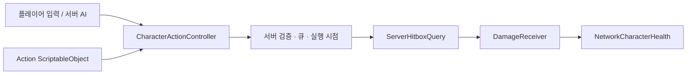

# Unity Modular Inventory & Stats Framework
### Project G · Gameplay Systems Portfolio

**서버 권한 전투 · 데이터 기반 스탯 · 그리드 인벤토리 · Unity Editor 도구**

Unity 6000.3.12f1 · C# · Netcode for GameObjects · ScriptableObject

[▶ 팀 프로젝트 데모](https://youtu.be/lBFEAHTD9JI) · [핵심 코드](#code-map) · [테스트 범위](#test-scope) · [에디터 도구](#editor-tools)

---

Project G에서 사용한 컴포넌트 기반 스탯·전투·인벤토리 관련 코드를 검토할 수 있도록 정리한 Unity 프로젝트입니다. 게임 데이터와 행동 설정은 ScriptableObject로 구성하고, 반복 설정 작업을 위한 전용 에디터 도구를 제공합니다.

> **검토 안내**  
> 실행 빌드 파일은 제공하지 않습니다. 아래 데모·스크린샷으로 팀 프로젝트의 적용 사례를 보고, 코드 링크로 구현 구조를 확인할 수 있습니다. **영상의 팀 프로젝트 전체와 이 공개 저장소의 재현 범위는 다릅니다.**

## Demo & Showcase

[▶ YouTube에서 팀 프로젝트 적용 영상 보기](https://youtu.be/lBFEAHTD9JI)

| Gameplay | Inventory | Combat |
| --- | --- | --- |
|  |  |  |

## Public Repository Scope

- 팀 프로젝트에서는 네트워크 환경의 인벤토리 동기화까지 작업했습니다.
- 해당 기능이 의존하는 **네트워크 커맨드 패턴은 협업자의 구현**으로, 이 공개 저장소에서는 제외했습니다.
- 따라서 공개 추출본에서 네트워크 루팅·인벤토리 동기화를 재현하려면 별도 연결 작업이 필요합니다.
- Grid Inventory에는 **Farrokh Games의 MIT 구현을 수정·확장한 부분**이 포함됩니다. 전체 인벤토리를 독자 구현한 것으로 표시하지 않으며, 원저작권과 라이선스를 아래에 명시합니다.

## 핵심 구현 · Code Map

| 관심 영역 | 먼저 볼 코드 | 확인할 설계 |
| --- | --- | --- |
| 액션 실행 | [CharacterActionController](Assets/@Scripts/Character/Actions/CharacterActionController.cs) | 허용 액션·쿨다운·생존 상태 검증, 고정 배열 큐와 실행 지연 |
| 다중 히트박스 | [ServerHitboxQuery](Assets/@Scripts/Character/Combat/ServerHitboxQuery.cs) | Box·Sphere·Capsule NonAlloc 쿼리, 동일 대상 중복 피해 방지 |
| 피해·체력 | [DamageReceiver](Assets/@Scripts/Character/Combat/DamageReceiver.cs) / [NetworkCharacterHealth](Assets/@Scripts/Character/Combat/NetworkCharacterHealth.cs) | 피해 수신과 네트워크 체력 상태의 역할 분리 |
| 장비 상태 | [NetworkCharacterEquipment](Assets/@Scripts/Character/Equipment/NetworkCharacterEquipment.cs) | 서버 쓰기 권한, 아이템 ID·슬롯 검증, 변경 이벤트 |
| 인벤토리 연결 | [PlayerInventoryEquipmentBridge](Assets/@Scripts/System/GridInventory/PlayerInventoryEquipmentBridge.cs) | 인벤토리와 장비 시스템을 연결하는 경계 |
| 히트박스 도구 | [HitboxActionAuthoringWindow](Assets/@Tools/Editor/HitboxAction/HitboxActionAuthoringWindow.cs) | Scene 핸들로 판정 범위를 조정하고 Action SO 생성 |
| 아이템 도구 | [ItemDatabaseEditor](Assets/@Tools/Editor/ItemDatabase/ItemDatabaseEditor.cs) | 아이템 일괄 등록·편집·중복 ID 확인 |
| 디버깅 | [CombatDebugLogger](Assets/@Scripts/Character/Debug/CombatDebugLogger.cs) | 액션·피격·피해·체력 변경 이벤트 추적 |

### 전투 처리 흐름

### 설계 의도와 경계

- **공통 컴포넌트:** 플레이어·몬스터의 공통 액션과 피해 처리를 조합할 수 있도록 역할을 분리했습니다.
- **데이터 중심 설정:** 제공된 히트박스 유형 안에서 공격 범위·쿨다운·피해 설정을 데이터로 조정합니다.
- **명시적인 연결:** Inspector 참조와 이벤트를 사용합니다. DI 컨테이너·R3는 현재 필수 의존성이 아닙니다.
- **검증 범위:** 장비 서버 검증은 아이템 ID·슬롯·손에 들 수 있는지에 대한 검사입니다. 실제 인벤토리 보유 여부까지 보장하는 검증은 포함하지 않습니다.
- **성능 범위:** 물리 쿼리 결과 배열을 재사용합니다. 프로젝트 전체의 GC Alloc 0 또는 특정 성능 향상 수치를 주장하지 않습니다.

## 테스트 범위 · Editor Review

**기준 버전:** Unity 6000.3.12f1  
**테스트 씬:** [Assets/Scenes/TestScenes.unity](Assets/Scenes/TestScenes.unity)  
**패키지 설정:** [Packages/manifest.json](Packages/manifest.json)

Unity Hub에서 저장소 루트를 프로젝트로 추가하고 위 버전으로 연 뒤, 패키지 복원이 완료되면 테스트 씬을 확인합니다. 아래 구분은 작성자가 안내하는 테스트 범위이며, 모든 기능이 기본 씬에 연결되어 있다는 의미는 아닙니다.

| 구분 | 범위 |
| --- | --- |
| 기본 테스트 씬 확인 대상 | 플레이어 이동, 서버 기준 피해 처리·체력 동기화, 범용 스탯 구성 |
| 추가 설정·연결 후 확인 | 액션 큐·쿨다운·실행 지연, 다중 히트박스, Friendly Fire, 서버 AI·액션 패턴, 스탯 Modifier, 스태미나, 상호작용 UI, 디버그 로그 |
| 공개본에 협업자 구현 미포함 | 네트워크 커맨드 패턴에 의존하는 인벤토리 루팅·동기화 |
| 배포 방식 | 소스·영상·스크린샷 제공 / 실행 빌드 미제공 |

### 주요 패키지

Netcode for GameObjects · Addressables · Cinemachine · Multiplayer Play Mode

## Editor Tools

### Item Database Editor

실행 경로: `Tools > Item Database Editor`

사용 방법:

1. `Item Database`에 편집할 데이터베이스 에셋을 지정합니다.
2. `Search Root`에 ItemData를 검색할 폴더를 지정합니다.
3. `Add All ItemData`로 폴더의 아이템 데이터를 데이터베이스에 일괄 등록합니다.
4. 필요한 항목을 수정한 뒤 `Save Assets`로 저장합니다.

지원 기능:

- ItemData 일괄 검색 및 등록
- ID, 이름, 등급, 타입, 장비 슬롯, 중첩 수량 등 주요 데이터 편집
- ItemID 중복 감지 및 중복 항목 필터링
- 타입별 필터 및 정렬
- Null 항목 제거와 ID 기준 데이터베이스 정렬

### Action Hitbox Authoring Tool

실행 경로: `Tools > Project G > Action Hitbox Authoring`

사용 방법:

1. 캐릭터 또는 공격 기준이 될 `Origin` Transform을 지정합니다.
2. Sphere, Box, Capsule 중 필요한 히트 볼륨을 추가합니다.
3. Scene 뷰의 Move, Rotate, Scale 도구로 위치와 크기를 조정합니다.
4. 쿨다운, 실행 지연, 데미지 배율, 최소 데미지, 대상 레이어 등을 설정합니다.
5. 저장 경로와 이름을 정한 뒤 `Create Hitbox Action SO`를 눌러 ScriptableObject를 생성합니다.

지원 기능:

- Sphere, Box, Capsule 형태의 복수 히트 볼륨 미리보기
- 기존 HitboxActionDefinition 불러오기 및 수정
- 공격 판정, 데미지 값, Friendly Fire 및 레이어 설정
- 완성된 HitboxActionDefinition ScriptableObject 생성
- 선택한 CharacterActionController에 생성 결과 자동 등록

## Future Architecture Considerations

### 의존성 탐색의 한계와 DI 개선 방향

현재 코드에는 Inspector 참조 외에도 런타임 탐색으로 의존성을 확보하는 부분이 있습니다.

- [PlayerInventoryEquipmentBridge](Assets/@Scripts/System/GridInventory/PlayerInventoryEquipmentBridge.cs)는 `GetComponent`로 입력·장비 컴포넌트를 얻고, 인벤토리 참조가 없으면 `FindFirstObjectByType<PlayerInventoryController>()`로 찾습니다.
- [CharacterActionController](Assets/@Scripts/Character/Actions/CharacterActionController.cs)는 초기화 시 `GetComponent`로 스탯·팀·체력 컴포넌트를 확보하며, 네트워크 시간과 실행 상태에 `NetworkManager.Singleton`을 사용합니다.
- [PlayerCameraLook](Assets/@Scripts/Player/Actions/PlayerCameraLook.cs)는 `Transform.Find("FollowTarget")`로 특정 이름의 자식 오브젝트를 찾습니다. 이는 씬 전체 탐색과는 다르지만 프리팹 계층·이름에 의존합니다.

**개선 방향:** 프로젝트를 확장하거나 재사용할 때는 씬 탐색과 전역 접근으로 숨겨진 의존성을 명시적 주입으로 전환하는 것을 권장합니다. 특히 다중 플레이어 환경에서는 '먼저 발견한 인벤토리'가 아니라 해당 플레이어의 인벤토리가 연결되도록 생성·연결 책임을 분명히 해야 합니다.

1. 고정된 Unity 오브젝트 참조는 우선 `[SerializeField]`로 명시하고 누락 여부를 검증합니다.
2. 런타임 생성 객체는 생성 담당자나 Composition Root에서 `Initialize(...)` 등 수동 주입으로 필요한 참조를 전달합니다. 순수 C# 서비스는 생성자 주입을 우선 고려합니다.
3. 연결 대상과 수명 관리가 복잡해지면 VContainer 등 DI 컨테이너를 선택적으로 도입하고, 네트워크 스폰·디스폰 시점과 객체 수명에 맞춰 구성합니다.

`GetComponent` 자체를 일괄 제거하는 것이 목표는 아닙니다. 같은 오브젝트의 필수 컴포넌트를 초기화 때 한 번 조회해 캐시하는 방식은 유지할 수 있습니다. 충돌로 새로 만난 대상의 컴포넌트 조회처럼 동적인 탐색은 DI로 단순 대체하지 않고 별도로 판단합니다.

DI의 목적은 **의존 관계·초기화 책임을 드러내고 테스트에서 대역을 주입하기 쉽게 만드는 것**입니다. 반복 탐색 비용은 호출 빈도와 Profiler 측정으로 판단하며, DI 도입만으로 성능 향상을 보장하지 않습니다. 위 내용은 현재 적용 완료 사항이 아닌 후속 리팩터링 방향입니다.

### 선택적 라이브러리 도입

현재 구조는 기능을 작은 컴포넌트로 분리하고, Inspector 참조와 이벤트를 통해 연결합니다. 
프로젝트 규모가 커져 컴포넌트 간 의존성과 초기화 순서 관리가 복잡해질 경우 다음 방식을 선택적으로 검토할 수 있습니다.

- **Dependency Injection:** 인벤토리, 스탯, 전투 서비스의 생성과 연결을 Composition Root에 모아 결합도를 낮추고 테스트 교체를 쉽게 만듭니다.
Unity 환경에서는 [VContainer](https://github.com/hadashiA/VContainer) 같은 DI 컨테이너를 후보로 고려할 수 있습니다.

- **R3:** 체력·스탯·인벤토리 변경처럼 연속적으로 발생하는 이벤트를 반응형 스트림으로 구성하여 UI 갱신과 상태 구독 코드를 단순화할 수 있습니다.
후보 라이브러리로 [Cysharp R3](https://github.com/Cysharp/R3)를 검토할 수 있습니다.

두 방식은 현재 프로젝트의 필수 의존성이 아니며, 단순한 컴포넌트 연결까지 무조건 대체하기보다 의존 관계와 이벤트 흐름이 실제로 복잡해지는 시점에 필요한 영역부터 도입하는 것을 목표로 합니다.

## Third-Party Attribution

### Grid Inventory

This repository includes modified portions of a Grid Inventory implementation.

- Original copyright: Copyright (c) 2020 Farrokh Games
- License: MIT License
- License notice: [Farrokh Games MIT License](LICENSES/Farrokh-Games-MIT.md)

The inventory implementation was adapted and extended for this project.

## References

The following resources were consulted as architectural and implementation references for this project.

- [Character Stats by Kryzarel - Unity Asset Store](https://assetstore.unity.com/packages/tools/utilities/character-stats-106351)
- [Unity Multiplayer Samples Co-op - GitHub](https://github.com/Unity-Technologies/com.unity.multiplayer.samples.coop)

No original package source files or assets from these references are included or redistributed in this repository.
